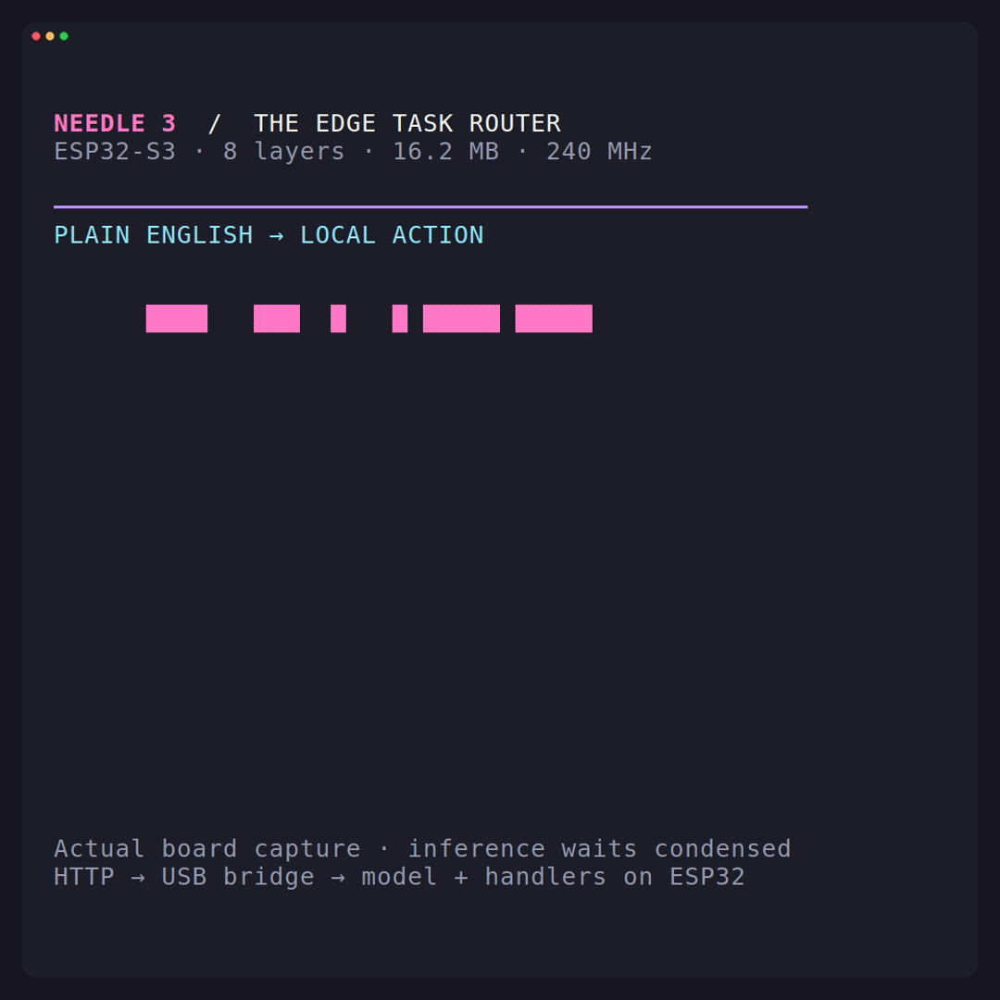
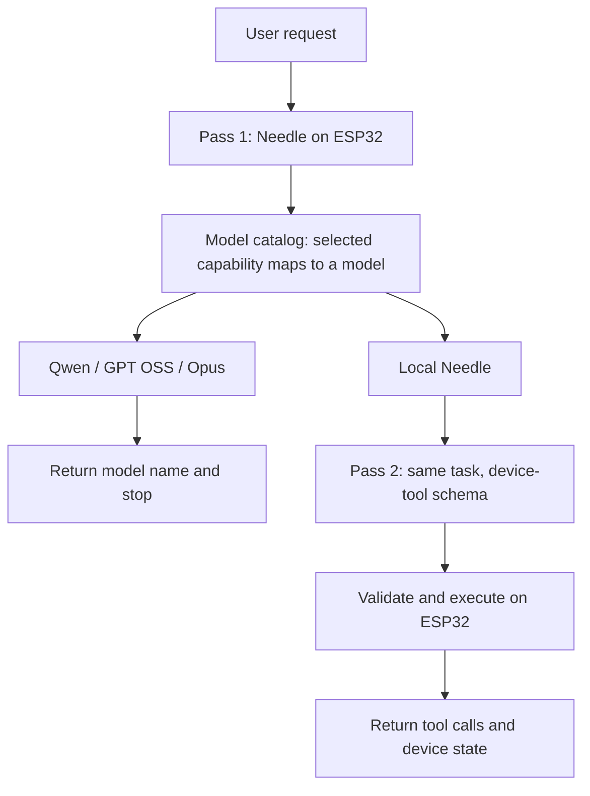

# Needle 3: an agent-watch model router on ESP32

**Which model should handle this request?** Needle runs on an ESP32-S3 and routes
tasks to one of four configured choices: **Claude Opus, Qwen 3.8 27B, GPT OSS
120B, or local Needle**. External choices end at selection. A local choice invokes
Needle a second time with a device-tool schema, then executes and verifies the
actual device operations.

[Watch MP4](demo/needle3-router.mp4) · [Download GIF](demo/needle3-router.gif) · [Recorded responses](demo/recording.json)



This is a watch-brain proof of concept on an ESP32 development board. The 51-second Dracula video
shows real recorded inference with waits condensed and actual timings displayed.
The HTTP bridge on the computer orchestrates both passes; both model inferences
and all local tool handlers execute on the ESP32. No external LLM is called.

## Scenarios

| Request | Configured model | What happens next |
| --- | --- | --- |
| Translate good morning into Spanish | Qwen 3.8 27B | Show selected model; end scenario |
| Write a Python function to deduplicate a list | GPT OSS 120B | Show selected model; end scenario |
| Design a secure architecture for a fleet of agent watches | Claude Opus | Show selected model; end scenario |
| How much free memory does this device have? | Local Needle | Second inference → `get_status()` → real device snapshot |
| Sample telemetry every 5 seconds | Local Needle | Second inference → `set_sampling_interval(5)` → actual periodic sampler |
| Start a 60 second timer | Local Needle | Second inference → `set_timer(60)` → real countdown |
| Sample every 10 seconds and start a 30 second timer | Local Needle | Second inference → two calls → changed cadence and running countdown |

## How model routing works



The small tool-calling model works better with concrete capability names than
bare model-name classification. [`tools/model-routes.json`](tools/model-routes.json)
therefore presents six capability routes, each bound to a model by
[`tools/model-catalog.json`](tools/model-catalog.json):

- `translate_or_write` → Qwen 3.8 27B.
- `write_code` → GPT OSS 120B.
- `research_and_plan` → Claude Opus.
- `get_status`, `set_timer`, `set_sampling_interval` → local Needle.

**Pass 1 executes no device tools.** Its grammar permits exactly one route with
empty arguments. The model selects that route through inference; the bridge
only looks up its configured model mapping. There is no keyword classifier or
expected-answer override. Model names and task assignments are deployment labels
and demo policy supplied in the catalog, not a benchmark of those larger models.

If Needle is selected, the bridge sends the **unchanged original request** back
to the same ESP32 under [`tools/demo-tools.json`](tools/demo-tools.json).
This second inference generates tool arguments and can produce multiple calls.
The firmware validates all calls before executing any. Timer/cadence arguments
must be integers from 1 to 3600 seconds.

Both schema prefixes have independent caches including KV, convolution and
engram state, sharing one model's weights and scratch memory. Switching schemas
does not require a full prefill. The route phase uses a 213-token prefix; the
execution phase uses 143 tokens. The model now has a **384-token context** so
both schemas fit with room for the request and generation.

## Scope and limits

- These are curated development scenarios, not a held-out routing benchmark.
  Early experiments with bare model-name selection misrouted many tasks. Routing
  remains sensitive to schema and phrasing; a successful demo does not imply
  general reliability or optimal model choice.
- The confidence head is not implemented (`confidence: null`). Structural
  validation cannot guarantee correct intent.
- Local requests require **two real inference passes**. The recording includes
  both latencies and total time; the video condenses the waits. This is for
  occasional commands, not a real-time control loop.
- The sampler stores the latest heap/uptime sample and count. Countdown expiry
  increments a real device counter. There are no external sensors, watch display,
  home-automation devices or physical lights connected in this demo.
- The computer serves HTTP through USB UART; this build does not serve HTTP over
  ESP32 Wi-Fi. The API is bound to localhost without authentication. The bridge
  serializes each entire two-pass transaction, including state reads.
- External selections stop at the model label. No credentials, remote endpoints,
  provider responses or simulated cloud answers are involved.

## Measured capture

Recorded on 2026-09-18 with the eight-layer ESP32 model. Routing and
execution times include the USB/HTTP bridge. External scenarios do not include
a larger-model inference because they end at selection.

| Scenario | Selected model | Route | Local tools | Total |
| --- | --- | ---: | ---: | ---: |
| translation | Qwen 3.8 27B | 25.72 s | — | 25.72 s |
| coding | GPT OSS 120B | 28.99 s | — | 28.99 s |
| architecture | Claude Opus | 33.17 s | — | 33.17 s |
| status | Needle 3 / on watch | 24.02 s | 23.39 s | 47.41 s |
| sampling | Needle 3 / on watch | 27.38 s | 29.08 s | 56.46 s |
| timer | Needle 3 / on watch | 20.73 s | 23.43 s | 44.16 s |
| batch | Needle 3 / on watch | 29.88 s | 40.51 s | 70.39 s |

The device collected **31 telemetry samples** during the sequence and
recorded **2 timer expiries**. All seven expected model selections and
all second-pass tool calls matched. These are curated examples, not an accuracy estimate.

## Hardware and dependencies

Tested with an **ESP32-S3, 32 MB octal flash, 16 MB octal PSRAM, 240 MHz** and
ESP-IDF **5.5.2**. The 16,155,796-byte model is mapped from a dedicated flash
partition. This partition layout does not fit a 16 MB flash board.

The tested board exposes `/dev/ttyACM0` for flashing and `/dev/ttyACM1` for its
UART console. Port names vary: use your device's actual ports, preferably stable
`/dev/serial/by-id/` names. Your user must have serial access (typically the
`dialout` group on Linux).

Host prerequisites: Git, Python 3.11+, `venv` (or `virtualenv`), GNU Make,
CMake and a C compiler for host tests. Install and activate
[ESP-IDF](https://docs.espressif.com/projects/esp-idf/en/v5.5.2/esp32s3/get-started/index.html)
for firmware builds. VHS, ttyd and FFmpeg are needed only to render the demo.

## Build and run

From the repository root:

```sh
make setup
make model
make verify-model
```

`make model` downloads the pinned public archive, verifies its SHA-256, slices
the already quantized tensors to **8 layers / 384 tokens**, and verifies the
result. [`model/manifest.json`](model/manifest.json) records the revision and
hashes. Model archives and generated build files are excluded from Git.
Upgrading from the earlier tool-only demo requires both `make model` and a full
`make flash`: the model context changed from 256 to 384 tokens.

In a shell with ESP-IDF activated (`. /path/to/esp-idf/export.sh`):

```sh
make flash FLASH_PORT=/dev/ttyACM0
```

This builds and flashes the application, then writes the model at `0x210000`.
For later firmware-only changes, use `make flash-app`. Stop the API service and
any serial monitor before flashing. Two schema prefixes are cached at boot
(143 tool tokens and 213 routing tokens);
a cold start takes roughly five minutes. The bridge waits up to ten minutes.

Run the bridge in the foreground:

```sh
make serve SERIAL_PORT=/dev/ttyACM1
```

Or install it as a Linux systemd **user service** after closing the foreground bridge:

```sh
make install-service SERIAL_PORT=/dev/ttyACM1
systemctl --user status needle3-api
journalctl --user -u needle3-api -f
```

The installer uses this checkout's absolute path and `.venv`; rerun it if you move
the checkout. It starts with your user session. Uninstall with
`systemctl --user disable --now needle3-api`, remove
`~/.config/systemd/user/needle3-api.service`, and run
`systemctl --user daemon-reload`.

## API

```sh
curl -sS http://127.0.0.1:8081/models
curl -sS http://127.0.0.1:8081/health
curl -sS --max-time 600 -H 'Content-Type: application/json' \
  -d '{"input":"Sample every 10 seconds and start a 30 second timer"}' \
  http://127.0.0.1:8081/agent
```

| Endpoint | Behavior |
| --- | --- |
| `GET /models` | Configured model labels, policies and capability mappings |
| `GET /health` | Readiness and live device state |
| `GET /state` | Read current device state without inference |
| `POST /agent` | Select model; stop if external, or make a second local inference and execute |
| `POST /route` | One routing inference only; return the selected capability |
| `POST /complete` | Bypass routing and run the device-tool inference directly |

All POST endpoints accept `{"input":"your request"}`. `/agent` returns
`selected_model`, `outcome`, `inference_passes`, `remote_called: false`,
`routing` (the first pass), `execution` (the second pass or `null`), and total
`latency_ms`. Each pass includes generated `function_calls`, raw model text,
execution results, and prefill/decode timing. Outcomes are `external_selected`,
`local_executed`, `route_failed`, or `local_failed`.

Inputs must be single lines of at most 255 UTF-8 bytes and fit the remaining model
context. Control characters and serial command prefixes are rejected. Errors use
400 for invalid requests, 502 for firmware/tool failures, 503 for unavailable
hardware, and 504 for inference timeout. After a serial timeout, finish/reset the
board and restart the bridge to restore synchronization. Reasoning is disabled
by default; `tools/serial_api.py --think` enables it.

## Capture, render and test

```sh
make test        # host grammar, prefix isolation, and bridge protocol tests
make capture     # seven real end-to-end scenarios; requires board + API
make demo        # render MP4 + GIF with VHS from the saved recording
```

See [demo instructions](demo/README.md). The capture saves expected routes,
actual model outputs, both inference passes, state snapshots, timings and
model/schema hashes. It checks all seven routes, actual local tool calls,
external stop behavior, advancing telemetry, changed cadence and timer expiry.
The renderer refuses to present a success demo if those checks fail.

Tests verify that external selections stop after one inference and local
selections submit the original request for a second inference. C tests verify
single-selection grammar and bit-identical logits after alternating prefix caches
(the latter runs when the model archive is present). Protocol tests also cover
multiple tool calls, stream boundaries, firmware errors and timeout recovery.

Optional NumPy reference checks use `requirements-dev.txt` and
[`tools/reference_forward.py`](tools/reference_forward.py). Profiling is disabled
by default; enable it with `idf.py -C esp32 -DNEEDLE_PROFILE=ON build`.

## Implementation and provenance

The eight-layer archive is 16,155,796 bytes, mapped from flash. The port adapts
the Apache-2.0 [Needle 2 ESP32 engine](https://github.com/andrisgauracs/needle-2-esp32)
with Needle 3 archive support, QKV convolution, separate Q/K and V widths,
Monarch Hadamard MLP and mHC lanes. Weights are from
[Cactus Compute](https://cactuscompute.com/needle) and downloaded separately from
the pinned [Needle 3 model repository](https://huggingface.co/Cactus-Compute/needle3).

Code: [Apache-2.0](LICENSE). Attribution: [NOTICE](NOTICE).
Media: [Charmbracelet VHS](https://github.com/charmbracelet/vhs), Dracula theme.
